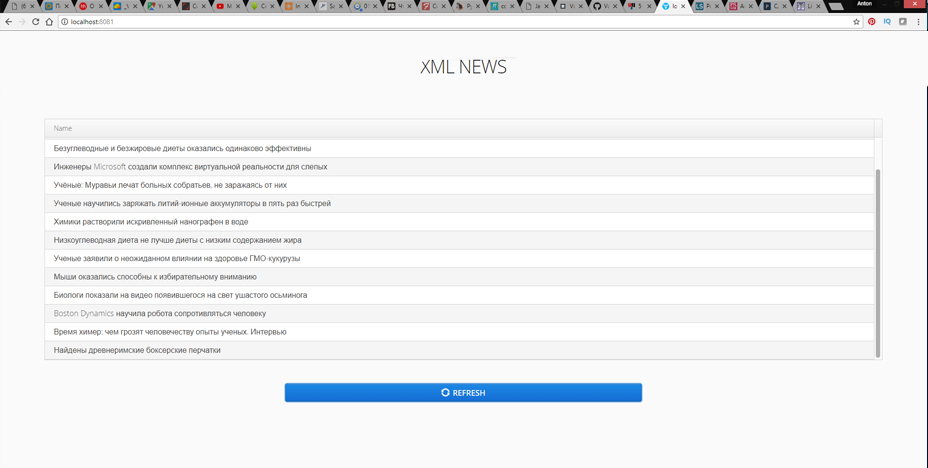

# Vaadin & Spring-boot XML RSS-feed news parser

Simple XML RSS-feed news parser with JAXB + VAADIN + SpringBoot

Run application:
```
mvn package spring-boot:run
```
and open: http://localhost:8081


### Screenshot



### Links
* [Vaadin 8](https://vaadin.com/framework)
* [Spring Initializr](https://start.spring.io/)